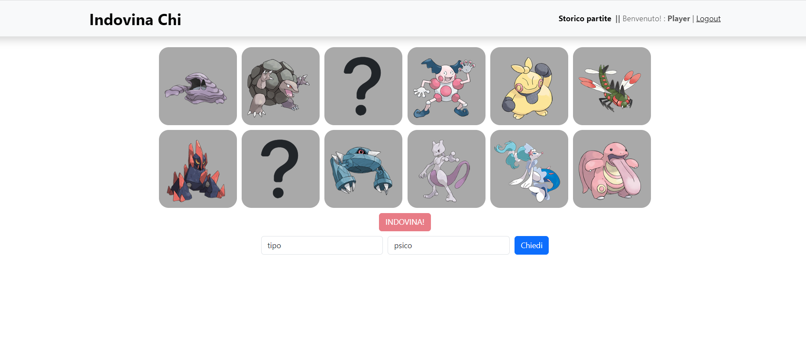

## Routes Applicazione Client React

- Route `/`: route comune a tutte le pagine dell'applicazione contentente la barra di navigazione
- Route `""`: route che comprende il contenuto principale dell'applicazione dove è possibile iniziare una nuova partita e giocarla
- Route `login`: route per la pagina dedicata al login utente 
- Route `history`: route dedicata alla visualizzazione dello storico partite di un utente loggato
- Route `*`: pagina visualizzata in caso di route non valida utilizzata allo scopo di reindirizzare l'utente alla pagina principale

## API Server

- POST `/api/sessions`
  - il _body_ contiene l'utente che è autenticato tramite username e password
  - quando autenticato restituisce `id`, `email`, `username`
- DELETE `/api/session/`
  - nessun _body_ nessun _parametro_
  - effettua il logout dalla sessione corrente
- GET `/api/session/current`
  - nessun _body_, nessun _parametro_
  - se l'utente è _autenticato_ restituisce `id`, `email`, `username` altrimenti _undefined_
  - se fallisce _500 DB error_

- GET `/api/carte/:num`
  - nessun _body_
  - _parametri_ : _num_ rappresentante il numero di carte da dovere restituire
  - restituisce le carte e i loro attributi: `id`,`nome`,`immagine`,`flipped`(stato della carta),`attributi[]`(lista degli attributi)
  - se fallisce _500 DB error_
- POST `/api/try`
  -  il _body_ contiene l'attrivuto da verificare
  - restituisce `true` o `false` in base al risocntro positivo o negativo del parametro passato rispetto agli attributi della carta segreta
  - se fallisce _500 DB error_
- POST `/api/guess`
  -  il _body_ contiene l'`id della carta selezionata` e i `punti` calcolati come _numero carte - mosse_
  - restituisce `true` in caso di carta corrispondete a quella segreta o `false` altrimenti, e restituisce l'`id della carta segreta`
  - se fallisce _500 DB error_
- DELETE `/api/clear`
  - nessun _body_, nessun _parametro_
  - elimina le partite pending di un determinato utente
  - se fallisce _500 DB error_
- GET `/api/history`
  - nessun _body_, nessun _parametro_
  - restituisce la lista di tutte le partite effettuate dall'utente come `id`, `data`, `nomeCarta`,`immagine`,`difficoltà`, `punteggio`
  - se fallisce _500 DB error_
- GET `/api/history/total`
  - nessun _body_, nessun _parametro_
  - restituisce il `punteggio totale` dell'utente
  - se fallisce _500 DB error_
- POST `/api/attributi`
  - nessun _parametro_, il _body_ contiene le `carte` estratte per la partita 
  - restituisce la lista degli `attributi` associabili alle carte estratte se hanno almeno 2 valori possbili 
  - se fallisce _500 DB error_
- POST `/api/valori`
  - nessun _parametro_, il _body_ contiene le `carte` estratte per la partita e la `tipologia` selezionata 
  - restituisce i valori possibili per l'attributo selezionato come {`id`,`valore`}
  - se fallisce _500 DB error_

## Tabelle Database

- Tabella `UTENTI` - contiene ID EMAIL USERNAME HASH SALT
- Tabella `PARTITE` - contiene ID ID_UTENTE ID_CARD DATA DIFF PUNTEGGIO STATO
- Tabella `CARTE` - contiene ID NOME IMMAGINE
- Tabella `ATTRIBUTI` - contiene ID TIPOLOGIA VALORE
- Tabella `ASS_CARD_ATTR` - contiene ID ID_CARD ID_ATTR

## Componenti principali

- `Grid` (in `Grid.jsx`): griglia di dimensione dinamica per rappresentare tutte le carte inizilamente grige e poi raffiguranti un soggetto
- `GuessForm` (in `GuessForm.jsx`): form di selezione attributi e valori per poter fare le domande
- `History` (in `History.jsx`): componente rappresentante lo storico partite di un utente e il suo punteggio totale
- `GameResultModal` (in `Utili.jsx`): Modale utilizzato per visualizzare l'esito della partia, il punteggio e la carta segreta

## Screenshot

Pagina principale durante una giocata

## Credenziali Utenti

- Username: giovanni@gmail.com, Password: pass                  _utente senza partite_
- Username: player@gmail.com, Password: pass                    _utente con partite_
- Username: indovino@gmail.com, Password: pass                  _utente con partite_

